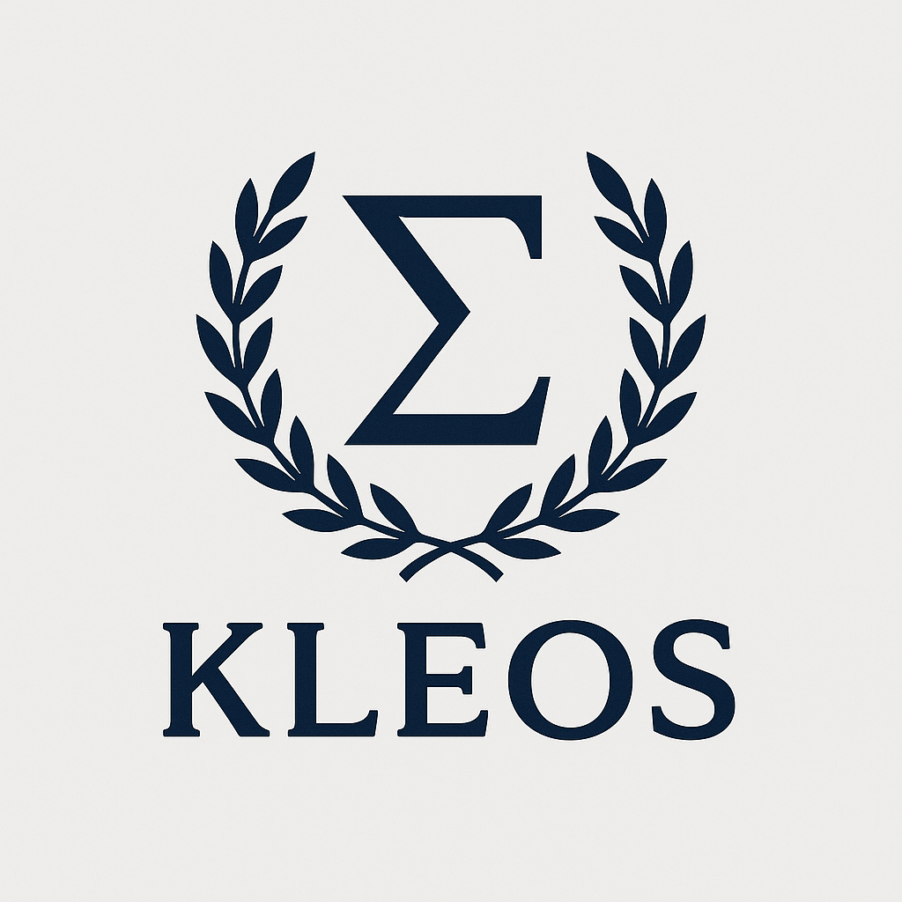

  

<i>Complete, efficient GPU residency for Distributed Machine Learning.</i>

---

## 🌹Kleos: GPU-Resident Runtime for ML

**Kleos** is an ongoing research project exploring the design of a GPU-native operating system for distributed machine learning workloads. The goal is to eliminate CPU bottlenecks by fusing scheduling, communication, and compute **directly on the GPU** using lightweight, asynchronous primitives.

### 🎯 Vision and Methods
We aim to achieve *complete, efficient GPU residency*. We investigate optimizations that approach hardware peak performance for both distributed and single GPU workloads, where bulk-synchronous, CPU-driven orchestration is a limiting factor.
To attain this vision, we employ *kernel fusion* enabled by (1) algorithmic innovations with strong theoretical footing and (2) principled systems design and implmentation. 

> This repository represents a *very* early-stage release of Kleos infrastructure.

---

## 🗞️ News

- **June 5, 2025** — ⚡️Introducing **FlashDMoE**, a fused GPU kernel for distributed MoE execution.  
  ➤ See [`this README`](./csrc/include/kleos/moe/README.MD) for details, benchmarks, and usage.

---

## ⚖️ License

This project is licensed under the BSD 3-Clause License. See [`LICENSE`](./LICENSE) for full terms.
