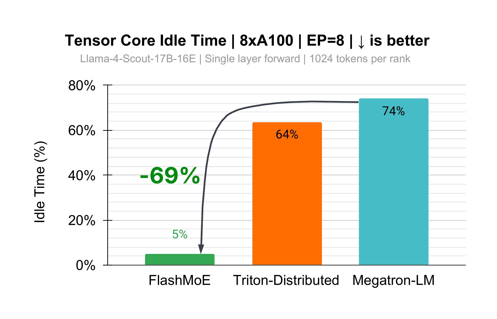
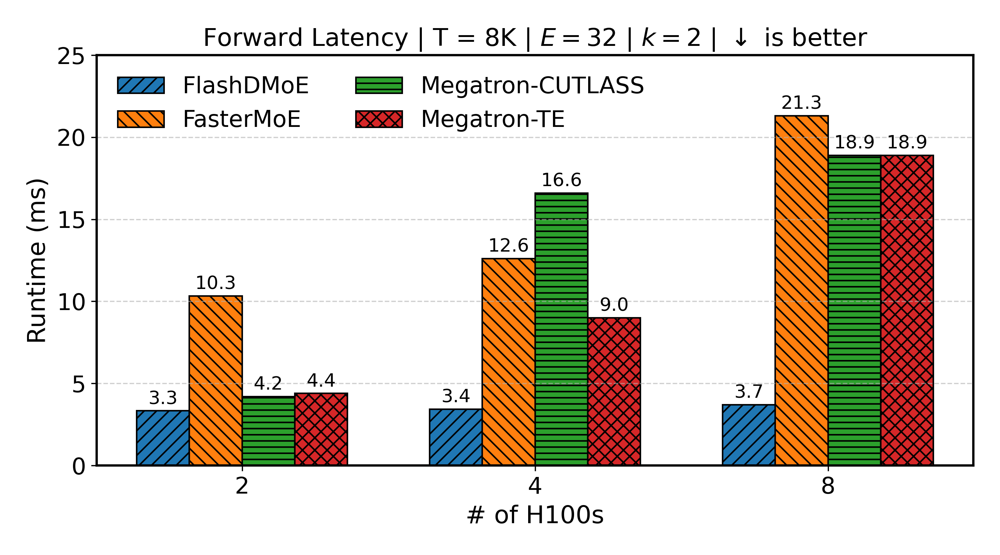
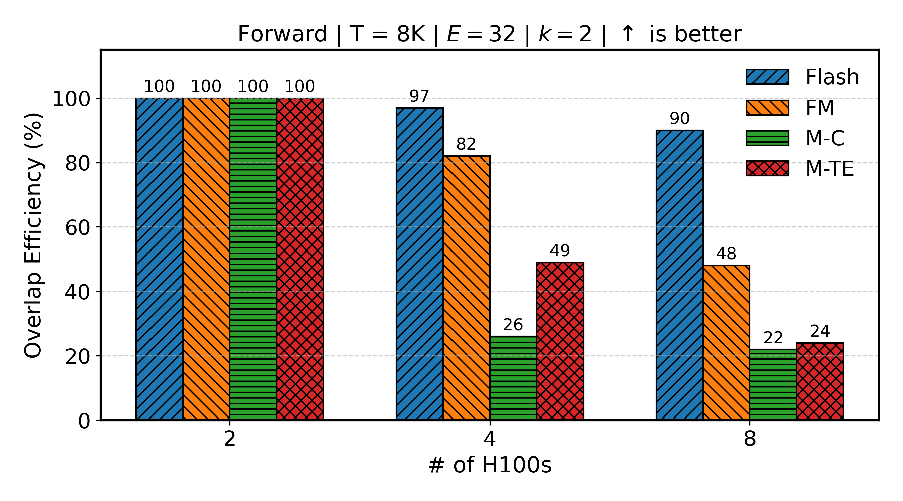
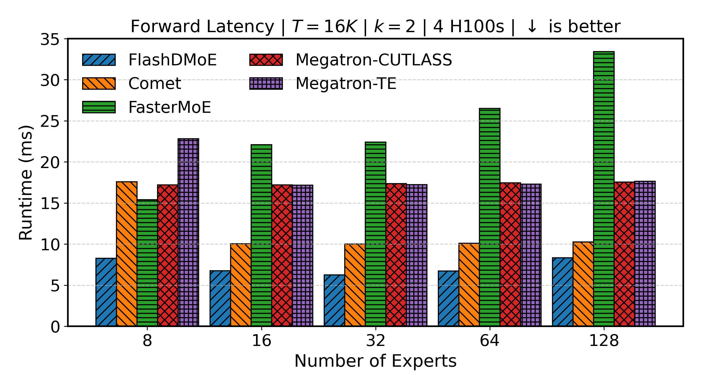
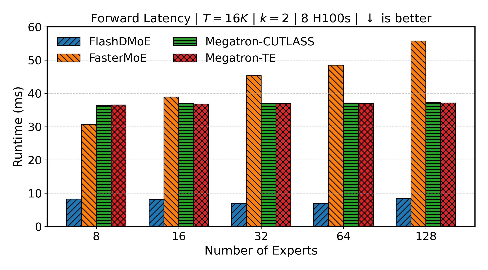
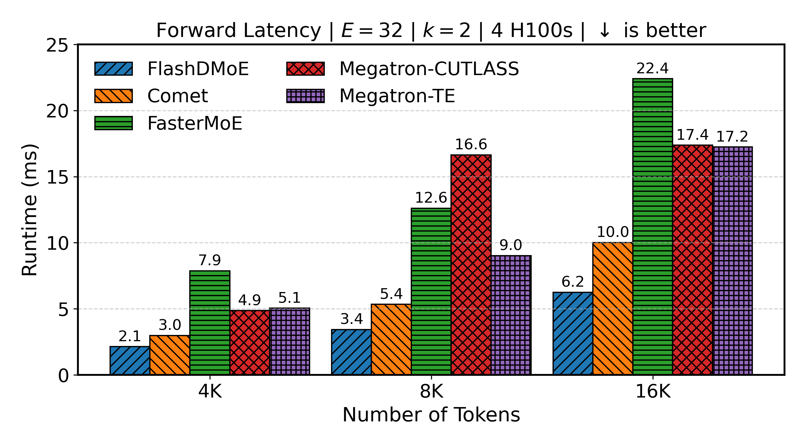
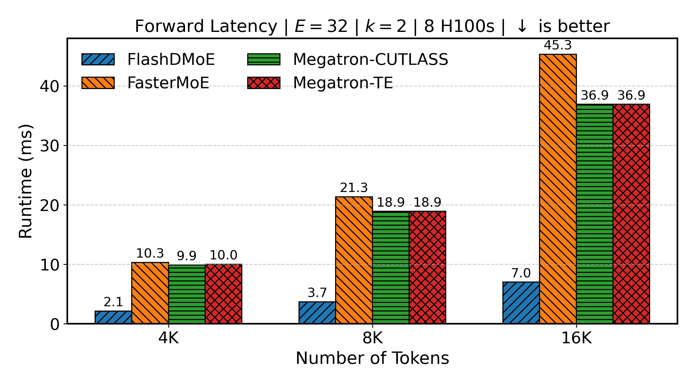

# FlashMoE: Fast Distributed MoE in a Single Kernel [NeurIPS '25]

Completely fused distributed MoE providing high-performance single- and multi-node EP inference.

> 🚧 We are largely stable but still under active research, so please raise issues for any observed bugs.

---

## 🗞️ News

- **Feb 2026** — **FlashMoE** v0.1.0 is out! 
- **Sept 18, 2025** — **FlashMoE** will appear at NeurIPS'25 (main track)! 
- **June 5, 2025** — ⚡️Introducing **FlashMoE** 

---
# 🚀 QuickStart

## Requirements
(1) CUDA toolkit (2) ninja (`sudo apt install ninja-build`) (3) CMake

### Install cuBLASDx
- Download from [here](https://developer.nvidia.com/cublasdx-downloads) and save in `<your_directory>`, e.g `~/.local`.
- export `MATHDX_ROOT=<your_directory>/nvidia-<...>/mathdx/yy.mm/`

### Install NVSHMEM
- Install as directed [here](https://developer.nvidia.com/nvshmem-downloads).
- export `NVSHMEM_LIB_HOME=/usr/lib/x86_64-linux-gnu/nvshmem/<12 or 13>`. Note you should confirm that this directory exists!

> 👉 Tip: add `MATHDX_ROOT=...` and `NVSHMEM_LIB_HOME=...` to `.bashrc`

## Use Python API
- pip install
- call gate.forward, then moe.forward
- torchrun
## Use C++ API
- cpm
- include header file
- call forward
- mpirun

---

## 🧠 Overview

**FlashMoE** is a high-throughput, portable, correct GPU kernel that fuses the following **Distributed Mixture-of-Experts (DMoE)** operations:
- MoE Dispatch
- Expert computation (Gated MLP or conventional MLP)
- MoE Combine

...into a *single, tile-pipelined, persistent kernel*. 

It is written from scratch entirely in **pure CUDA C++**, leaning heavily on 
[cubLASDx](https://docs.nvidia.com/cuda/cublasdx/) and [NVSHMEM](https://developer.nvidia.com/nvshmem), 
for compute and communication, respectively.

### 🏎️ Portability

we support 
- $\geq$ SM70 GPUs. Boosting compute performance for Hopper and Blackwell is on the roadmap.
- NVLink and RDMA (EFA, IBGDA, libfabric as NVSHMEM [supports](https://docs.nvidia.com/nvshmem/release-notes-install-guide/install-guide/abstract.html#hardware-requirements)).
- FP16, BF16, FP32 (TF32), FP64.

### ✅ Roadmap
- [ ] Improve MMA for Hopper (WGMMA) and Blackwell (UTCMMA).
- [ ] FP8
- [ ] Research on improvements
- [ ] AMD support

---

## 📊 Performance Results
We compare against [COMET](https://github.com/bytedance/flux) (MLSys '25), [Megatron-LM](https://github.com/NVIDIA/Megatron-LM), and 
[Triton-Distributed](https://github.com/ByteDance-Seed/Triton-distributed).
<div align="center">
  
  <p><em>Tensor Core Utilization</em></p>
</div>

| Weak Scaling | Overlap Efficiency |
|:------:|:------:|
|  |  |

| Expert Scalability on 4 H100s | Expert Scalability on 8 H100s |
|:------:|:------:|
|  |  |
| **Token Scaling on 4 H100s** | **Token Scaling on 8 H100s** |
|  |  |

Compared to SOTA baselines, Flash: 
1. increases Tensor core uptime by up to **69%**, 
2. reduces E2E layer latency by up to **6x**, 
3. attains **4x** better weak scaling efficiency

---

## Run Benchmark (C++)
- Install NVSHMEM and cuBLASDx.
- 


## IDEs
The codebase integrates well with CLion, just open the project at `csrc`.

---

## Contributions
We welcome them! Submit a PR!

# 📖 Citation
If you can, please cite as below:
```
@misc{aimuyo2025flashmoe,
      title={FlashMoE: Fast Distributed MoE in a Single Kernel}, 
      author={Osayamen Jonathan Aimuyo and Byungsoo Oh and Rachee Singh},
      year={2025},
      eprint={2506.04667},
      archivePrefix={arXiv},
      primaryClass={cs.DC},
      url={https://arxiv.org/abs/2506.04667}, 
}
```
